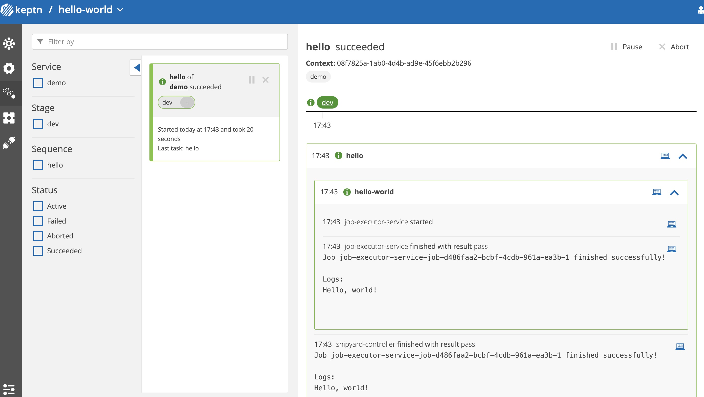

Keptn uses a declarative approach to build scalable automation for delivery and operations which can be scaled to a large number of services.

This Katacoda scenario comes pre installed with a single node K3s cluster and helm3 installed. 

First of all, you will need to create a cluster for Keptn, and then install and configure Keptn itself.
We'll run Keptn on a local k3s cluster.
## Check the cluster

In order to check the cluster just run  `kubectl cluster-info &&
kubectl get nodes`{{execute}}

 ## Install and expose keptn

 Every Keptn release provides binaries for the Keptn CLI. These binaries are available for Linux, macOS, and Windows.

`curl -sL https://get.keptn.sh | KEPTN_VERSION=0.12.0 bash &&
helm install keptn https://github.com/keptn/keptn/releases/download/0.12.0/keptn-0.12.0.tgz -n keptn --create-namespace`{{execute}}


`helm install -n keptn job-executor-service https://github.com/keptn-contrib/job-executor-service/releases/download/0.1.6/job-executor-service-0.1.6.tgz`{{execute}}

Once you have all pods running on the cluster as below, you can go ahead and execute the next command:
```
NAME                         READY   STATUS
bridge-*                     1/1     Running
approval-service-*           2/2     Running
api-gateway-nginx-*          1/1     Running
webhook-service-*            2/2     Running
lighthouse-service-*         2/2     Running
keptn-mongo-*                1/1     Running
remediation-service-*        2/2     Running
configuration-service-*      1/1     Running
secret-service-*             1/1     Running
keptn-nats-cluster-0         2/2     Running
api-service-*                2/2     Running
mongodb-datastore-*          2/2     Running
shipyard-controller-*        2/2     Running
statistics-service-*         2/2     Running
job-executor-service-*       2/2     Running
```
You can check all the pods if running with this below command:
`watch kubectl get pods -n keptn`{{execute}}

# Expose Keptn:

Run the following to expose the bridge (UI) on a loadBalancer.

`helm upgrade keptn https://github.com/keptn/keptn/releases/download/0.12.0/keptn-0.12.0.tgz -n keptn --set=control-plane.apiGatewayNginx.type=LoadBalancer`{{execute}}

Get Keptn endpoint: Get the EXTERNAL-IP of the api-gateway-ngix using the command below. The Keptn API endpoint is: http://<ENDPOINT_OF_API_GATEWAY>/api

`export KEPTN_ENDPOINT=$(kubectl get services -n keptn api-gateway-nginx -o=jsonpath='{.status.loadBalancer.ingress[0].ip}') &&
echo "Keptn Available at: http://$KEPTN_ENDPOINT"`{{execute}}

# Authenticate Keptn CLI

`keptn auth --endpoint=$KEPTN_ENDPOINT`{{execute}}
## Visualization 

You can also view the trigerred result in a UI



