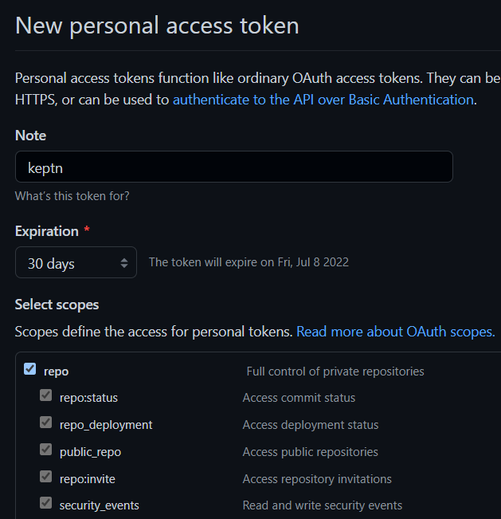

# Keptn Multistage Delivery and Self-Healing with Helm, Prometheus, Locust and SLO-based Quality Gates
The goal of this tutorial is to:

- Deploy a microservice (using [helm](https://helm.sh))
- Generate load on the deployed service (using [locust](https://locust.io))
- Add approval gates into the delivery pipeline
- Add automated SLO-based quality evaluations both pre and post release
- Show how keptn can orchestrate self-healing patterns and tools (like scaling a helm deployment)

Keptn is unopinionated about tooling. A key strength of Keptn is it allows you to bring the tooling you already use and with which you are familiar.

That said, we needed to pick some tools and Helm + Locust are two modern and widely used tools.

The tutorial will progress in steps:

1. Automated testing and releases into `qa` and `production` stages
2. An approval step will be added to ensure a human must always click “go” before a production release
3. Add Prometheus to the cluster to monitor the workloads. Add SLO-based quality evaluations to ensure no bad build ever makes it to production.
4. Add a quality evaluation in production, post rollout. If a bad deployment occurs, the evaluation will fail and remediation actions (scaling) will be actioned (using `helm` to `helm upgrade` the application).

## While You're Waiting...

While you have been reading, we have been busy installing everything. It is still happening and should only take a few minutes.

While you wait, you will need a brand new uninitialised Git repo and personal access token to follow this tutorial.

You can use any Git provider but assuming you're using GitHub.com, follow the instructions below.

Let's get you setup while you wait for the install to finish.

1. Go to GitHub.com
2. Create a brand new, uninitialised repository. Do not add any files (eg. readme). The repo must have zero prior commits
3. Go to `https://github.com/settings/tokens` and generate a personal access token with full `Repo` permissions

## Relax...

You have everything you need now and just need to wait for us to finish the installation.

Please wait here until you see the text `Installation Completed 🎉. Please proceed now.` in the console.

