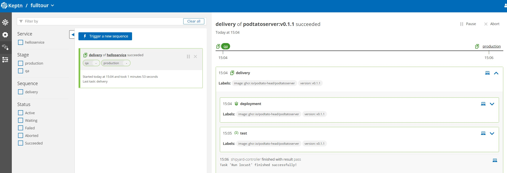

## Set Git Details As Environment Variables

Set your GitHub details as environment variables like this:

```
export GIT_USER=<YourUserName>
export GIT_REPO=https://github.com/<You>/<YourNewRepo>.git
export GIT_TOKEN=<YourGitPATToken>
```

For example (don't use this!):

```
export GIT_USER=dummyuser
export GIT_REPO=https://github.com/dummyuser/dummyrepo.git
export GIT_TOKEN=ghp_abcDEF123XYZ
```

Verify the details are correctly set by printing them to the console:

```
echo "Git Username: $GIT_USER"
echo "Git Repo: $GIT_REPO"
echo "GIT_TOKEN: $GIT_TOKEN"
```{{exec}}

## Create Keptn Project

A Keptn project is a high level logical container. A project contains stages (which mimic your environment eg. `dev` and `production`) and services (which mimic your microservices).

A Keptn project is modelled by a `shipyard.yaml` file which you must define.

Run the following to create a `shipyard.yaml` file on disk:

```
cd ~
cat << EOF > shipyard.yaml
apiVersion: "spec.keptn.sh/0.2.2"
kind: "Shipyard"
metadata:
  name: "shipyard-delivery"
spec:
  stages:
    - name: "qa"
      sequences:
        - name: "delivery"
          tasks:
            - name: "je-deployment"
            - name: "je-test"

    - name: "production"
      sequences:
        - name: "delivery"
          triggeredOn:
            - event: "qa.delivery.finished"
          tasks:
            - name: "je-deployment"
EOF
```{{exec}}

Create the project: `fulltour` and service called `helloservice` using the Keptn CLI.

The Keptn service name must be called precisely `helloservice` because the helm chart we use in this demo is called `helloservice.tgz` and the job executor runs `helm install` and relies on a file being available called `helloservice.tgz`.


```
keptn create project fulltour --shipyard shipyard.yaml --git-remote-url $GIT_REPO --git-user $GIT_USER --git-token $GIT_TOKEN
keptn create service helloservice --project=fulltour
```{{exec}}

## Add Application Helm Chart

Add the helm chart (this is the real application we will deploy). The `--resource` path is the path to files on disk whereas `--resourceUri` is the Git target folder. Do not change these. Notice also we’re uploading a helm chart with a name matching the keptn service: `helloservice.tgz`

```
cd keptn-job-executor-delivery-poc
keptn add-resource --project=fulltour --service=helloservice --all-stages --resource=./helm/helloservice.tgz --resourceUri=charts/helloservice.tgz
```{{exec}}

Add the files that locust needs:

```
keptn add-resource --project=fulltour --service=helloservice --stage=qa --resource=./locust/basic.py
keptn add-resource --project=fulltour --service=helloservice --stage=qa --resource=./locust/locust.conf
```{{exec}}

Add the job executor service config file. This tells the JES what container and commands to execute for each keptn task:

```
keptn add-resource --project=fulltour --service=helloservice --all-stages --resource=job-executor-config.yaml --resourceUri=job/config.yaml
```{{exec}}

## 🎉 Trigger Delivery

You are now ready to trigger delivery of the `helloservice` helm chart into all stages, testing along the way with locust:

Trigger a sequence via the Keptns API, via the bridge UI or via the keptn CLI:

```
keptn trigger delivery --project=fulltour --service=helloservice --image="ghcr.io/podtato-head/podtatoserver:v0.1.1" --labels=image="ghcr.io/podtato-head/podtatoserver",version="v0.1.1"
```{{exec}}



## What Happened?

Run `kubectl get namespaces`{{exec}}

Notice the 2 new namespaces: `fulltour-qa` and `fulltour-production`. Your app `helloservice.tgz` is deployed into each namespace thanks to the job executor service that ran `helm` (look at the `qa` and `production` branches in your repo at `helloservice/job/config.yaml`).

Helm is told to deploy `$(KEPTN_STAGE).tgz` (ie. `helloservice.tgz`).

```
NAME                  STATUS
default               Active
kube-system           Active
kube-public           Active
kube-node-lease       Active 
keptn                 Active  
keptn-jes             Active   
fulltour-qa           Active   2m
fulltour-production   Active   2m
```

Validate that pods version `v0.1.1` is running in both environments.

```
kubectl -n fulltour-qa describe pod -l app=helloservice | grep Image:
kubectl -n fulltour-production describe pod -l app=helloservice | grep Image:
```{{exec}}


Also notice that during the `je-test` task, locust was executed. The `job/config.yaml` file in the Git upstream also shows how this was done.

Result: Keptn orchestrated your deployment which was acheived using `helm` and `locust` to generate load.

----

## What Next?

Your application is being deployed into both QA and Production. This is great and indeed Keptn works with ArgoCD and Flux in the same way to ensure code is always up to date.

Sometimes, a manual approval step is required before an artifact is promoted to production. This is especially important right now as we are not testing the quality of the `helloservice` artifact. We will now add this.
